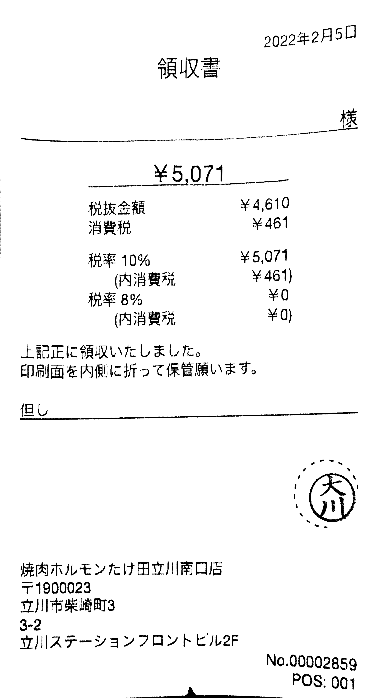
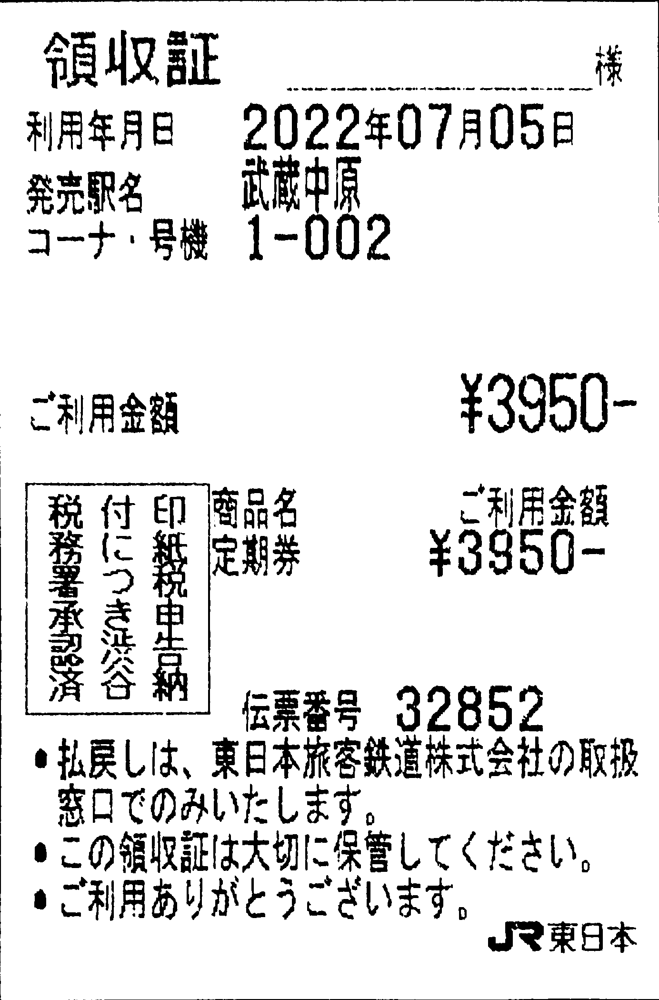
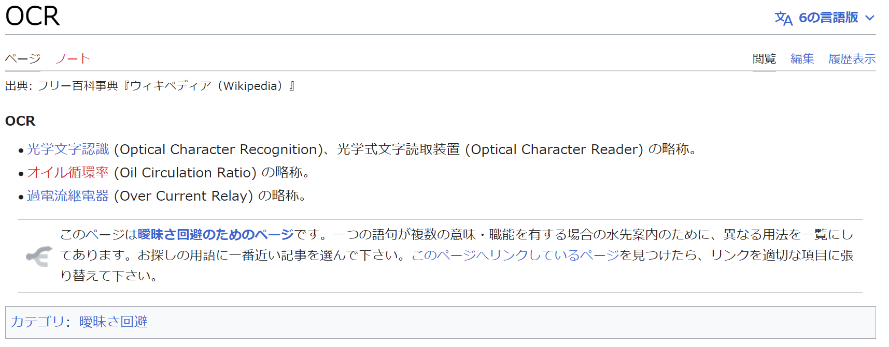
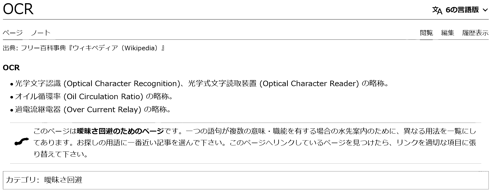

# 飲食店の領収書

## 前処理前
  

## 前処理後
1. グレースケール
2. 画像の二値化
3. 傾き補正
※スマホで撮影した画像は元々解像度が高いため超解像化は省略  

  

# 定期代の領収書

## 前処理前
  

## 前処理後
1. グレースケール
2. 画像の二値化
3. 傾き補正
※スマホで撮影した画像は元々解像度が高いため超解像化は省略  

  

# 精度確認用のwikipediaのスクリーンショット

## 前処理前
  

## 前処理後
1. グレースケール
2. 画像の二値化
3. SwinIRによる超解像化
※PCによるスクショでは傾き補正が不要  
  解像度が低いためSwinIRで超解像化  

  
