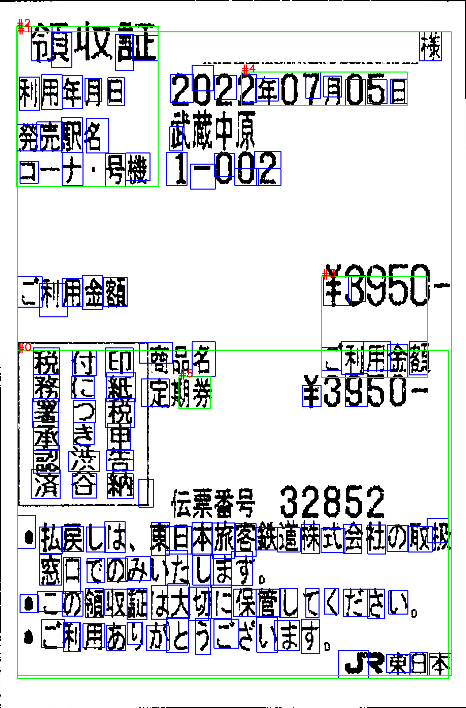
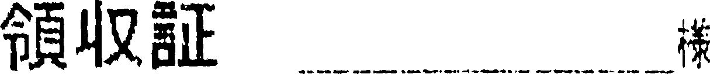
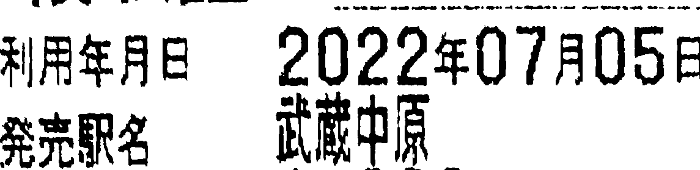
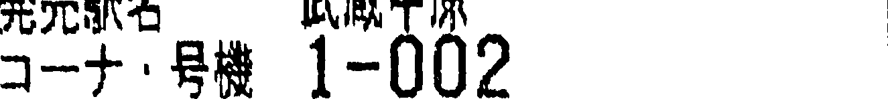
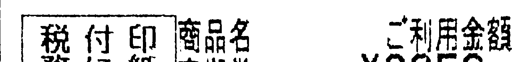
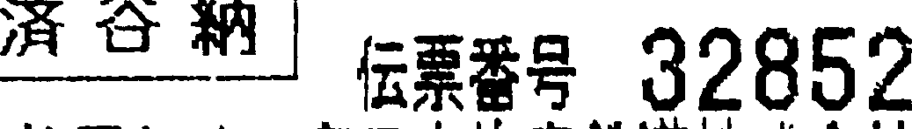

# OCR_Japanease
## 出力結果
```
ocr_receipt@0b7848d04c0f:~/src/OCR_Japanease$ python3 ocr_japanease.py --cpu --output_detect_img ../OCR_img/t1_dst_teiki1.png 
file "../OCR_img/t1_dst_teiki1.png" detected in 100 dpi.
[Block #0]
付
に紙促
署つ税
承き申
認洪告
済谷納」
.払民しは東旧本旅客数追株式会社の取初
窓eでのみたします
.:の領収証は大女に保管してください
ご利用あいがとうごいます
ぴ
[Block #1]
様
2n2
止
1二.Vり<
ご刑用金額了
税印廃名
務キ8
束日本
[Block #2]
令貝a止
利用年月日
発売駅名
コナ号機
[Block #3]
も
こ利用金額
[Block #4]
2年7日Uり日
[Block #5]
勝
```
## BoundingBox
  

# tesseract
## 出力結果
```
ocr_receipt1@c8c3e076ff51:~/src1/tools/04_character_detection/output/text/box$ grep "" t1_dst_teiki1_text_*
t1_dst_teiki1_text_00.txt:福 収 証 。 。 北
t1_dst_teiki1_text_01.txt:利用 年 有 B 202207H055
t1_dst_teiki1_text_02.txt:似る
t1_dst_teiki1_text_03.txt:ュー ナ ・ 時 1-002
t1_dst_teiki1_text_04.txt:ご 利用 全額 #39bU-
t1_dst_teiki1_text_05.txt:「 科 人 印 商品 利用 人
t1_dst_teiki1_text_06.txt:務 に * 間 #※ 。 \9950-
t1_dst_teiki1_text_07.txt:法寺 番 呈 32852
t1_dst_teiki1_text_08.txt:。 払 良し は 、 東 日 本 旅人 多 株 式 会 の 取 提
t1_dst_teiki1_text_09.txt:容 日 で の みい た し ます 。
t1_dst_teiki1_text_10.txt:* この 令 収 証 は 大 切 に 保管 し て くだ さい 。
t1_dst_teiki1_text_11.txt:。 ご 利用 あり が と うこ ざい ます 。
t1_dst_teiki1_text_12.txt:J マ 東日本
t1_dst_teiki1_text_13.txt:| 還
```
## 文字認識に対応している画像
t1_dst_teiki1_result_00.png  
  
t1_dst_teiki1_result_01.png  
  
t1_dst_teiki1_result_02.png  
  
t1_dst_teiki1_result_03.png  
  
t1_dst_teiki1_result_04.png  
  
t1_dst_teiki1_result_05.png  
  
t1_dst_teiki1_result_06.png  
  
t1_dst_teiki1_result_07.png  
  
t1_dst_teiki1_result_08.png  
  
t1_dst_teiki1_result_09.png  
  
t1_dst_teiki1_result_10.png  
  
t1_dst_teiki1_result_11.png  
  
t1_dst_teiki1_result_12.png  
  
t1_dst_teiki1_result_13.png  
  

## BoundingBox
  

