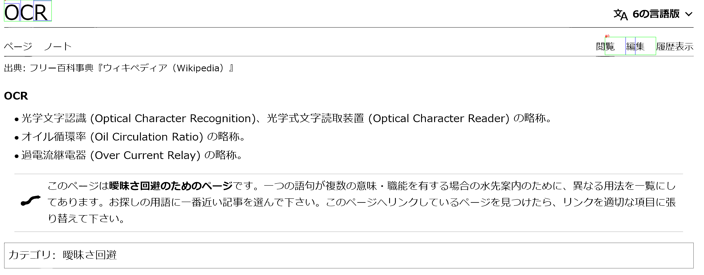
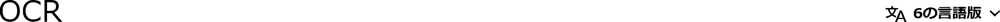
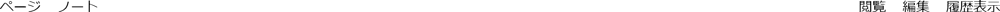
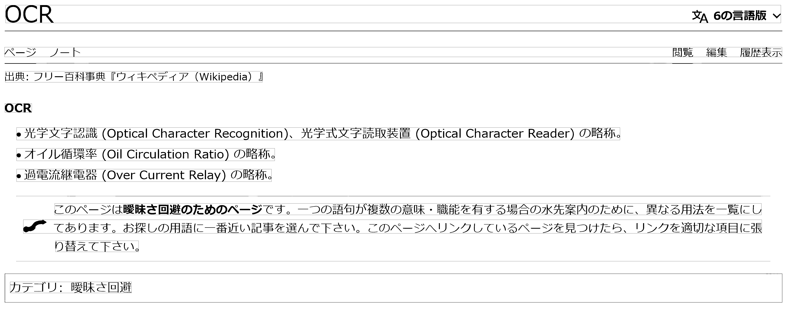

# OCR_Japanease
## 出力結果
```
ocr_receipt@0b7848d04c0f:~/src/OCR_Japanease$ python3 ocr_japanease.py --cpu --output_detect_img ../OCR_img/t1_wikipedia_ocr_1_SwinIR.png 
file "../OCR_img/t1_wikipedia_ocr_1_SwinIR.png" detected in 300 dpi.
[Block #0]
覧集
[Block #1]
OCR
```
## BoundingBox
  

# tesseract
## 出力結果
```
ocr_receipt1@c8c3e076ff51:~/src1/tools/04_character_detection/output/text/box$ grep "" t1_wikipedia_ocr_1_SwinIR_text_*
t1_wikipedia_ocr_1_SwinIR_text_00.txt:OCR 又 ^ 6 の 言語 版 マ
t1_wikipedia_ocr_1_SwinIR_text_01.txt:ペー ジ ノー トド 閲覧 編集 履歴 表示
t1_wikipedia_ocr_1_SwinIR_text_02.txt:出典 : フリ ー 百 科 事 典 『 ウ ィ キ ペデ ィ ア (Wikipedia) 』
t1_wikipedia_ocr_1_SwinIR_text_03.txt:OCR
t1_wikipedia_ocr_1_SwinIR_text_04.txt:s 光 字 又 字 認 識 (Optical Character Recognition)、 光 学 式 文字 読取 装置 (Optical Character Reader) の 賠 称 。
t1_wikipedia_ocr_1_SwinIR_text_05.txt:s オ イル 循環 率 (Oil Circulation Ratio) の 早 称 。
t1_wikipedia_ocr_1_SwinIR_text_06.txt:s 過 電流 継電器 (Over Current Relay) の 早 称 。
t1_wikipedia_ocr_1_SwinIR_text_07.txt:ご の ペー ジ は 曖昧 さ 回 避 の た め の ペ ー ジ で す 。 一 つの 語句 が 複数 の 意味 ・ 職 能 を 有する 場合 の 水先 案内 の た め に 、 異 な る 用 法 を 一 覧 に し
t1_wikipedia_ocr_1_SwinIR_text_08.txt:e。 て あり ます 。 お 探し の 用 語 に 一 番 近い 記事 を 選ん で 下さ い 。 ご の ペー ジ へ ヘリ ンク し て いる ペー ジ を 見 つけ た ら 、 リ ンク を 適切 な 項目 に 絹
t1_wikipedia_ocr_1_SwinIR_text_09.txt:り 替 えて 下さ い 。
t1_wikipedia_ocr_1_SwinIR_text_10.txt:カテ ゴリ : 曖昧 さ 回 避
```
## 文字認識に対応している画像
t1_wikipedia_ocr_1_SwinIR_result_00.png  
  
t1_wikipedia_ocr_1_SwinIR_result_01.png  
  
t1_wikipedia_ocr_1_SwinIR_result_02.png  
  
t1_wikipedia_ocr_1_SwinIR_result_03.png  
  
t1_wikipedia_ocr_1_SwinIR_result_04.png  
  
t1_wikipedia_ocr_1_SwinIR_result_05.png  
  
t1_wikipedia_ocr_1_SwinIR_result_06.png  
  
t1_wikipedia_ocr_1_SwinIR_result_07.png  
  
t1_wikipedia_ocr_1_SwinIR_result_08.png  
  
t1_wikipedia_ocr_1_SwinIR_result_09.png  
  
t1_wikipedia_ocr_1_SwinIR_result_10.png  
  

## BoundingBox
  

