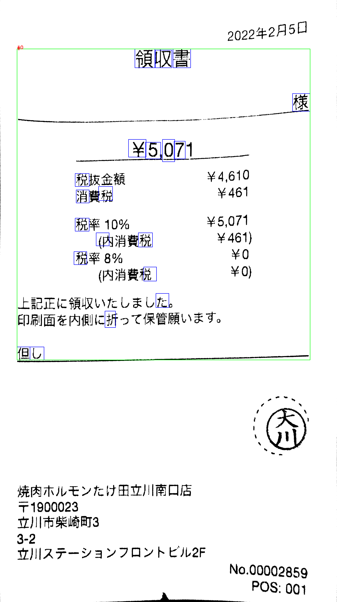

# OCR_Japanease
## 出力結果
```
ocr_receipt@0b7848d04c0f:~/src/OCR_Japanease$ python3 ocr_japanease.py --cpu --output_detect_img ../tools/02_homography/output/img_th1/th1_202202_receipt_1.png 
file "../tools/02_homography/output/img_th1/th1_202202_receipt_1.png" detected in 200 dpi.
[Block #0]
但
し
税消税税
税旧折
領¥5税克
収旦た
書7
様
```
## BoundingBox
  

# tesseract
## 出力結果
```
ocr_receipt1@c8c3e076ff51:~/src1/tools/04_character_detection/output/text/box$ grep "" th1_202202_receipt_1_text_*
th1_202202_receipt_1_text_00.txt:2022 年 2 月 5H
th1_202202_receipt_1_text_01.txt:領収 書
th1_202202_receipt_1_text_02.txt:ーー 。 欄
th1_202202_receipt_1_text_03.txt:\\5.071 。
th1_202202_receipt_1_text_04.txt:税 抜 金額 \4.610
th1_202202_receipt_1_text_05.txt:消費 税 \461
th1_202202_receipt_1_text_06.txt:税率 10% \5.071
th1_202202_receipt_1_text_07.txt:(内 消費 税 \461)
th1_202202_receipt_1_text_08.txt:税率 8% \0
th1_202202_receipt_1_text_09.txt:(内 消費 税 \0)
th1_202202_receipt_1_text_10.txt:上 記 正 に 領収 いた し まし た 。
th1_202202_receipt_1_text_11.txt:印刷 面 を 内 側 に 折っ て 保管 願い ます 。
th1_202202_receipt_1_text_12.txt:但し
th1_202202_receipt_1_text_13.txt:焼 内 ホル モン た け 田 立川 南口 店
th1_202202_receipt_1_text_14.txt:〒1900023
th1_202202_receipt_1_text_15.txt:立川 市 柴崎 町 3
th1_202202_receipt_1_text_16.txt:3-2
th1_202202_receipt_1_text_17.txt:立川 ステ ーション フロ ント ビル 2F
th1_202202_receipt_1_text_18.txt:No.00002859g
th1_202202_receipt_1_text_19.txt:ー ー ト POS: 001
```
## 文字認識に対応している画像
th1_202202_receipt_1_result_00.png  
  
th1_202202_receipt_1_result_01.png  
  
th1_202202_receipt_1_result_02.png  
  
th1_202202_receipt_1_result_03.png  
  
th1_202202_receipt_1_result_04.png  
  
th1_202202_receipt_1_result_05.png  
  
th1_202202_receipt_1_result_06.png  
  
th1_202202_receipt_1_result_07.png  
  
th1_202202_receipt_1_result_08.png  
  
th1_202202_receipt_1_result_09.png  
  
th1_202202_receipt_1_result_10.png  
  
th1_202202_receipt_1_result_11.png  
  
th1_202202_receipt_1_result_12.png  
  
th1_202202_receipt_1_result_13.png  
  
th1_202202_receipt_1_result_14.png  
  
th1_202202_receipt_1_result_15.png  
  
th1_202202_receipt_1_result_16.png  
  
th1_202202_receipt_1_result_17.png  
  
th1_202202_receipt_1_result_18.png  
  
th1_202202_receipt_1_result_19.png  
  

## BoundingBox
  

