# OCR_Japanease
## 出力結果
```
ocr_receipt@0b7848d04c0f:~/src/OCR_Japanease$ python3 ocr_japanease.py --cpu --output_detect_img ../tools/02_homography/output/img_th1/th1_202202_receipt_1.png 
file "../tools/02_homography/output/img_th1/th1_202202_receipt_1.png" detected in 200 dpi.
[Block #0]
但
し
税消税税
税旧折
領¥5税克
収旦た
書7
様
```
## BoundingBox
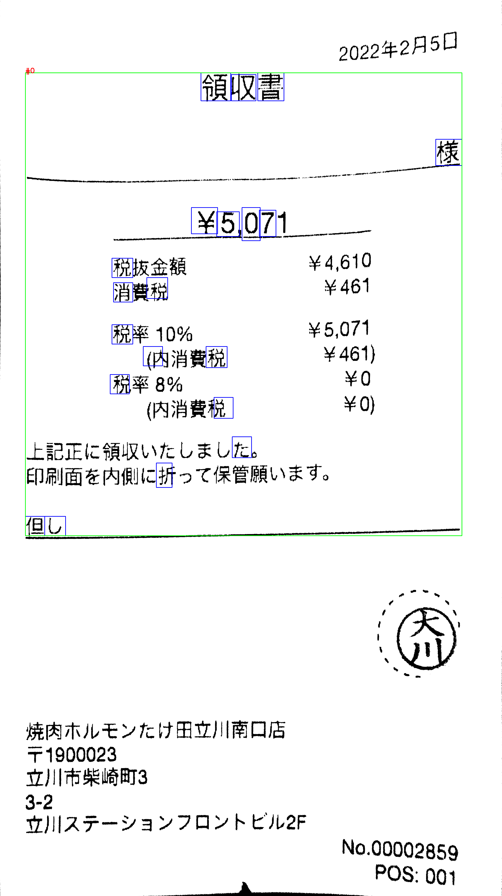  

# tesseract
## 出力結果
```
ocr_receipt1@c8c3e076ff51:~/src1/tools/04_character_detection/output/text/box$ grep "" th1_202202_receipt_1_text_*
th1_202202_receipt_1_text_00.txt:2022 年 2 月 5H
th1_202202_receipt_1_text_01.txt:領収 書
th1_202202_receipt_1_text_02.txt:ーー 。 欄
th1_202202_receipt_1_text_03.txt:\\5.071 。
th1_202202_receipt_1_text_04.txt:税 抜 金額 \4.610
th1_202202_receipt_1_text_05.txt:消費 税 \461
th1_202202_receipt_1_text_06.txt:税率 10% \5.071
th1_202202_receipt_1_text_07.txt:(内 消費 税 \461)
th1_202202_receipt_1_text_08.txt:税率 8% \0
th1_202202_receipt_1_text_09.txt:(内 消費 税 \0)
th1_202202_receipt_1_text_10.txt:上 記 正 に 領収 いた し まし た 。
th1_202202_receipt_1_text_11.txt:印刷 面 を 内 側 に 折っ て 保管 願い ます 。
th1_202202_receipt_1_text_12.txt:但し
th1_202202_receipt_1_text_13.txt:焼 内 ホル モン た け 田 立川 南口 店
th1_202202_receipt_1_text_14.txt:〒1900023
th1_202202_receipt_1_text_15.txt:立川 市 柴崎 町 3
th1_202202_receipt_1_text_16.txt:3-2
th1_202202_receipt_1_text_17.txt:立川 ステ ーション フロ ント ビル 2F
th1_202202_receipt_1_text_18.txt:No.00002859g
th1_202202_receipt_1_text_19.txt:ー ー ト POS: 001
```
## 文字認識に対応している画像
th1_202202_receipt_1_result_00.png  
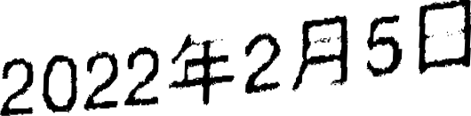  
th1_202202_receipt_1_result_01.png  
  
th1_202202_receipt_1_result_02.png  
  
th1_202202_receipt_1_result_03.png  
  
th1_202202_receipt_1_result_04.png  
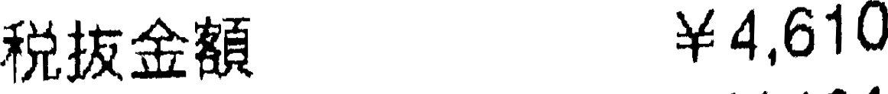  
th1_202202_receipt_1_result_05.png  
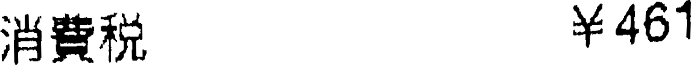  
th1_202202_receipt_1_result_06.png  
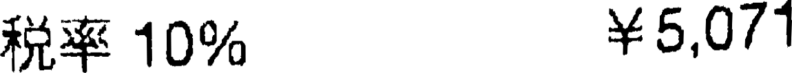  
th1_202202_receipt_1_result_07.png  
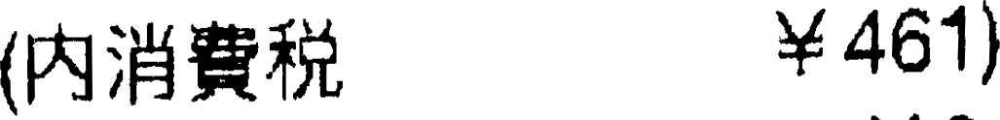  
th1_202202_receipt_1_result_08.png  
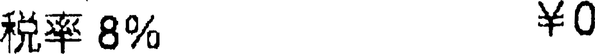  
th1_202202_receipt_1_result_09.png  
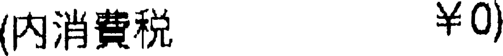  
th1_202202_receipt_1_result_10.png  
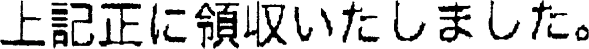  
th1_202202_receipt_1_result_11.png  
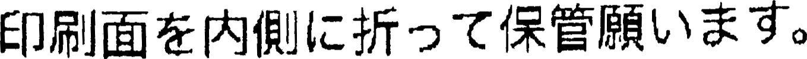  
th1_202202_receipt_1_result_12.png  
  
th1_202202_receipt_1_result_13.png  
  
th1_202202_receipt_1_result_14.png  
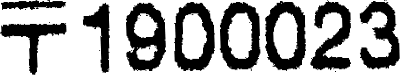  
th1_202202_receipt_1_result_15.png  
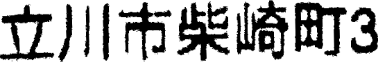  
th1_202202_receipt_1_result_16.png  
  
th1_202202_receipt_1_result_17.png  
  
th1_202202_receipt_1_result_18.png  
  
th1_202202_receipt_1_result_19.png  
  

## BoundingBox
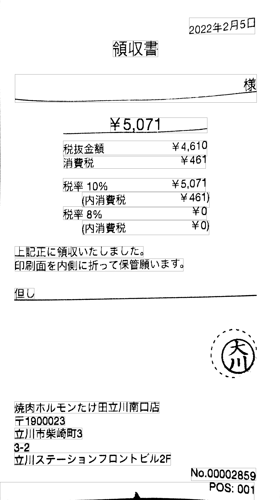  

# OCR_Japanease
## 出力結果
```
ocr_receipt@0b7848d04c0f:~/src/OCR_Japanease$ python3 ocr_japanease.py --cpu --output_detect_img ../OCR_img/t1_dst_teiki1.png 
file "../OCR_img/t1_dst_teiki1.png" detected in 100 dpi.
[Block #0]
付
に紙促
署つ税
承き申
認洪告
済谷納」
.払民しは東旧本旅客数追株式会社の取初
窓eでのみたします
.:の領収証は大女に保管してください
ご利用あいがとうごいます
ぴ
[Block #1]
様
2n2
止
1二.Vり<
ご刑用金額了
税印廃名
務キ8
束日本
[Block #2]
令貝a止
利用年月日
発売駅名
コナ号機
[Block #3]
も
こ利用金額
[Block #4]
2年7日Uり日
[Block #5]
勝
```
## BoundingBox
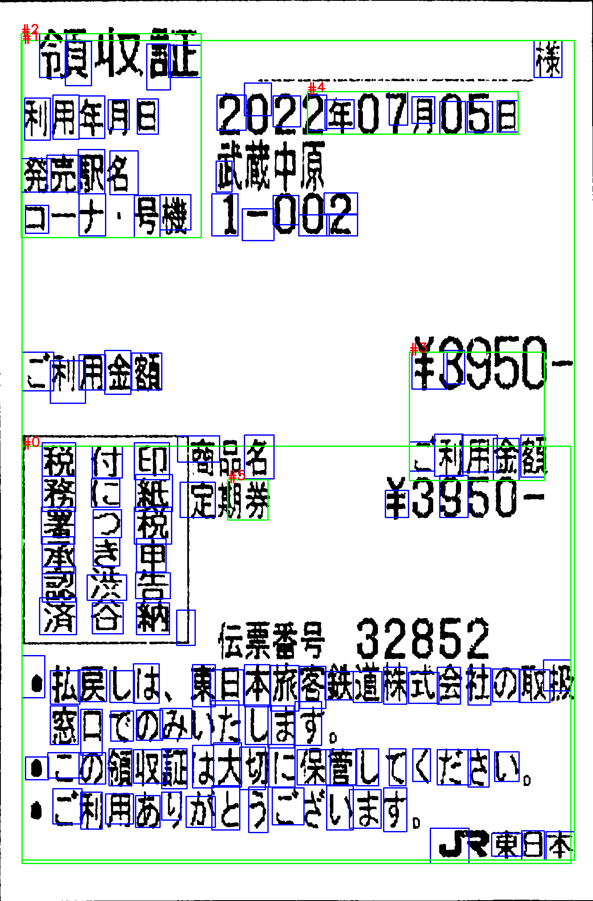  

# tesseract
## 出力結果
```
ocr_receipt1@c8c3e076ff51:~/src1/tools/04_character_detection/output/text/box$ grep "" t1_dst_teiki1_text_*
t1_dst_teiki1_text_00.txt:福 収 証 。 。 北
t1_dst_teiki1_text_01.txt:利用 年 有 B 202207H055
t1_dst_teiki1_text_02.txt:似る
t1_dst_teiki1_text_03.txt:ュー ナ ・ 時 1-002
t1_dst_teiki1_text_04.txt:ご 利用 全額 #39bU-
t1_dst_teiki1_text_05.txt:「 科 人 印 商品 利用 人
t1_dst_teiki1_text_06.txt:務 に * 間 #※ 。 \9950-
t1_dst_teiki1_text_07.txt:法寺 番 呈 32852
t1_dst_teiki1_text_08.txt:。 払 良し は 、 東 日 本 旅人 多 株 式 会 の 取 提
t1_dst_teiki1_text_09.txt:容 日 で の みい た し ます 。
t1_dst_teiki1_text_10.txt:* この 令 収 証 は 大 切 に 保管 し て くだ さい 。
t1_dst_teiki1_text_11.txt:。 ご 利用 あり が と うこ ざい ます 。
t1_dst_teiki1_text_12.txt:J マ 東日本
t1_dst_teiki1_text_13.txt:| 還
```
## 文字認識に対応している画像
t1_dst_teiki1_result_00.png  
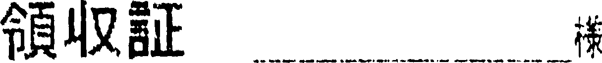  
t1_dst_teiki1_result_01.png  
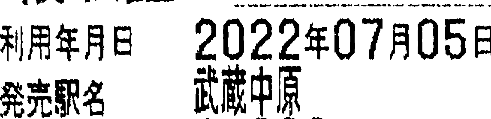  
t1_dst_teiki1_result_02.png  
  
t1_dst_teiki1_result_03.png  
  
t1_dst_teiki1_result_04.png  
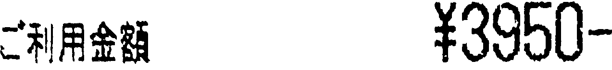  
t1_dst_teiki1_result_05.png  
  
t1_dst_teiki1_result_06.png  
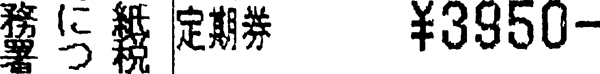  
t1_dst_teiki1_result_07.png  
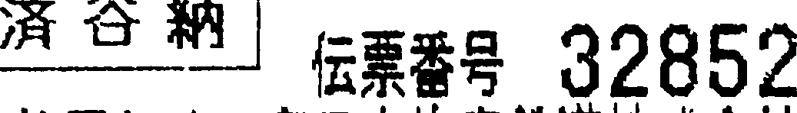  
t1_dst_teiki1_result_08.png  
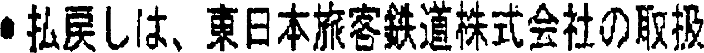  
t1_dst_teiki1_result_09.png  
  
t1_dst_teiki1_result_10.png  
  
t1_dst_teiki1_result_11.png  
  
t1_dst_teiki1_result_12.png  
  
t1_dst_teiki1_result_13.png  
  

## BoundingBox
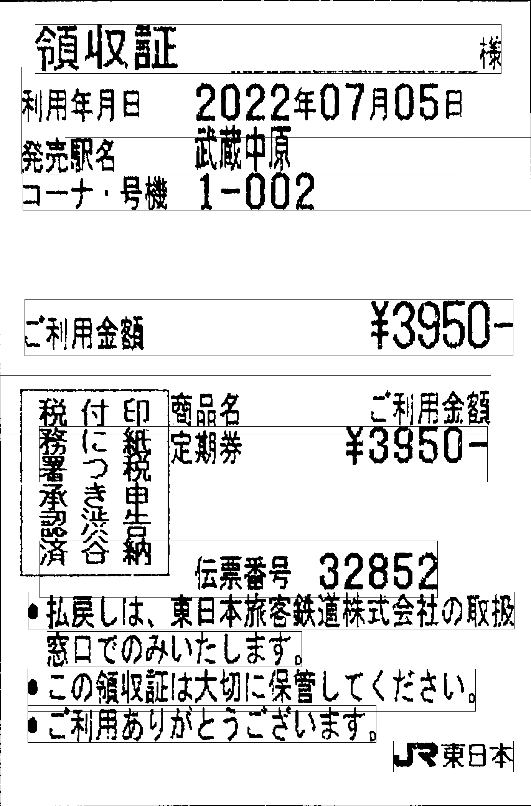  

# OCR_Japanease
## 出力結果
```
ocr_receipt@0b7848d04c0f:~/src/OCR_Japanease$ python3 ocr_japanease.py --cpu --output_detect_img ../OCR_img/t1_wikipedia_ocr_1_SwinIR.png 
file "../OCR_img/t1_wikipedia_ocr_1_SwinIR.png" detected in 300 dpi.
[Block #0]
覧集
[Block #1]
OCR
```
## BoundingBox
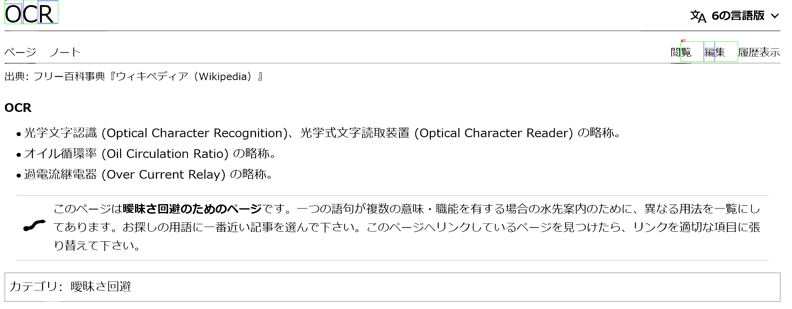  

# tesseract
## 出力結果
```
ocr_receipt1@c8c3e076ff51:~/src1/tools/04_character_detection/output/text/box$ grep "" t1_wikipedia_ocr_1_SwinIR_text_*
t1_wikipedia_ocr_1_SwinIR_text_00.txt:OCR 又 ^ 6 の 言語 版 マ
t1_wikipedia_ocr_1_SwinIR_text_01.txt:ペー ジ ノー トド 閲覧 編集 履歴 表示
t1_wikipedia_ocr_1_SwinIR_text_02.txt:出典 : フリ ー 百 科 事 典 『 ウ ィ キ ペデ ィ ア (Wikipedia) 』
t1_wikipedia_ocr_1_SwinIR_text_03.txt:OCR
t1_wikipedia_ocr_1_SwinIR_text_04.txt:s 光 字 又 字 認 識 (Optical Character Recognition)、 光 学 式 文字 読取 装置 (Optical Character Reader) の 賠 称 。
t1_wikipedia_ocr_1_SwinIR_text_05.txt:s オ イル 循環 率 (Oil Circulation Ratio) の 早 称 。
t1_wikipedia_ocr_1_SwinIR_text_06.txt:s 過 電流 継電器 (Over Current Relay) の 早 称 。
t1_wikipedia_ocr_1_SwinIR_text_07.txt:ご の ペー ジ は 曖昧 さ 回 避 の た め の ペ ー ジ で す 。 一 つの 語句 が 複数 の 意味 ・ 職 能 を 有する 場合 の 水先 案内 の た め に 、 異 な る 用 法 を 一 覧 に し
t1_wikipedia_ocr_1_SwinIR_text_08.txt:e。 て あり ます 。 お 探し の 用 語 に 一 番 近い 記事 を 選ん で 下さ い 。 ご の ペー ジ へ ヘリ ンク し て いる ペー ジ を 見 つけ た ら 、 リ ンク を 適切 な 項目 に 絹
t1_wikipedia_ocr_1_SwinIR_text_09.txt:り 替 えて 下さ い 。
t1_wikipedia_ocr_1_SwinIR_text_10.txt:カテ ゴリ : 曖昧 さ 回 避
```
## 文字認識に対応している画像
t1_wikipedia_ocr_1_SwinIR_result_00.png  
  
t1_wikipedia_ocr_1_SwinIR_result_01.png  
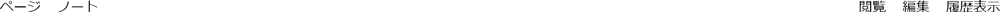  
t1_wikipedia_ocr_1_SwinIR_result_02.png  
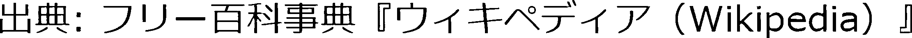  
t1_wikipedia_ocr_1_SwinIR_result_03.png  
  
t1_wikipedia_ocr_1_SwinIR_result_04.png  
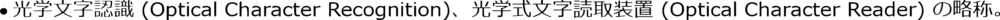  
t1_wikipedia_ocr_1_SwinIR_result_05.png  
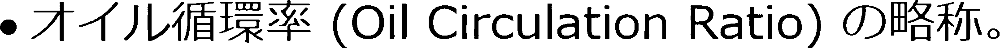  
t1_wikipedia_ocr_1_SwinIR_result_06.png  
  
t1_wikipedia_ocr_1_SwinIR_result_07.png  
  
t1_wikipedia_ocr_1_SwinIR_result_08.png  
  
t1_wikipedia_ocr_1_SwinIR_result_09.png  
  
t1_wikipedia_ocr_1_SwinIR_result_10.png  
  

## BoundingBox
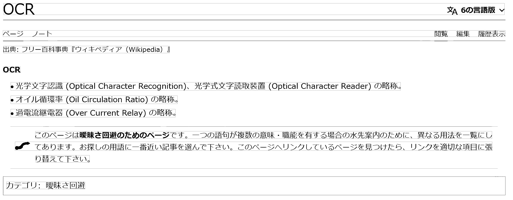  

